# 🏗️ Архитектура проекта S3 Storage Application

## Общая архитектура системы

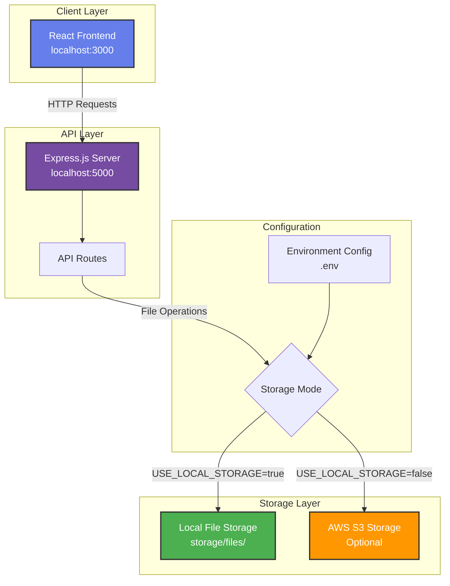

## Детальная архитектура API

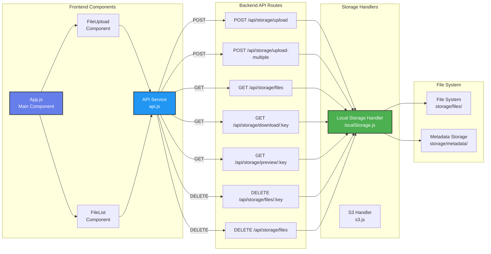

## Поток данных при загрузке файла

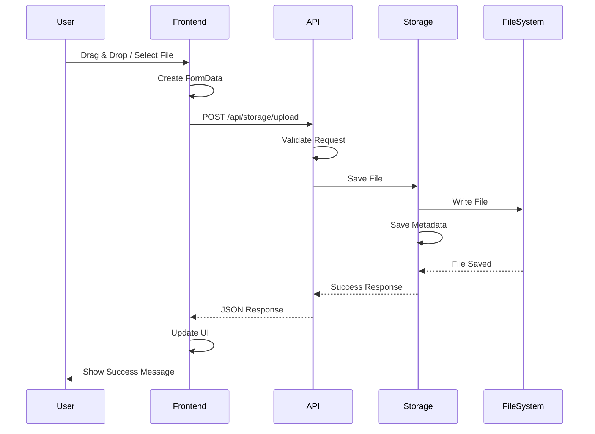

## Поток данных при получении списка файлов

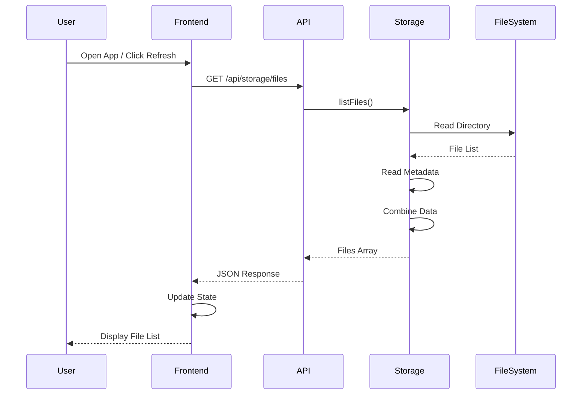

## Структура модулей

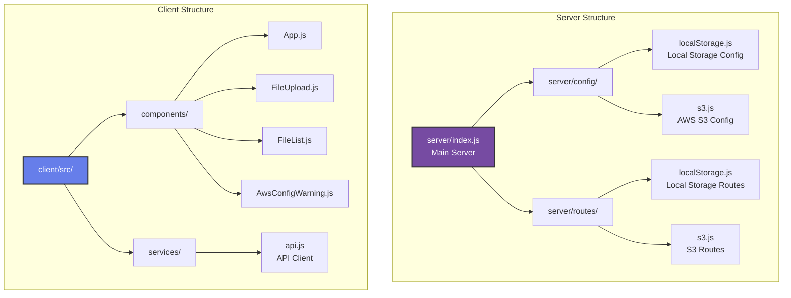

## API Endpoints Architecture

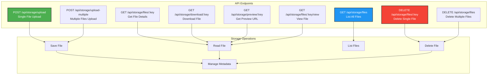

## Технологический стек

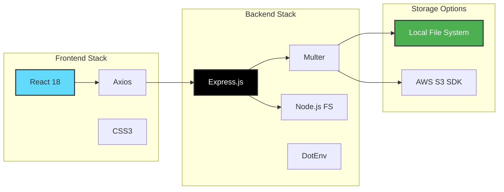

## Режимы работы системы

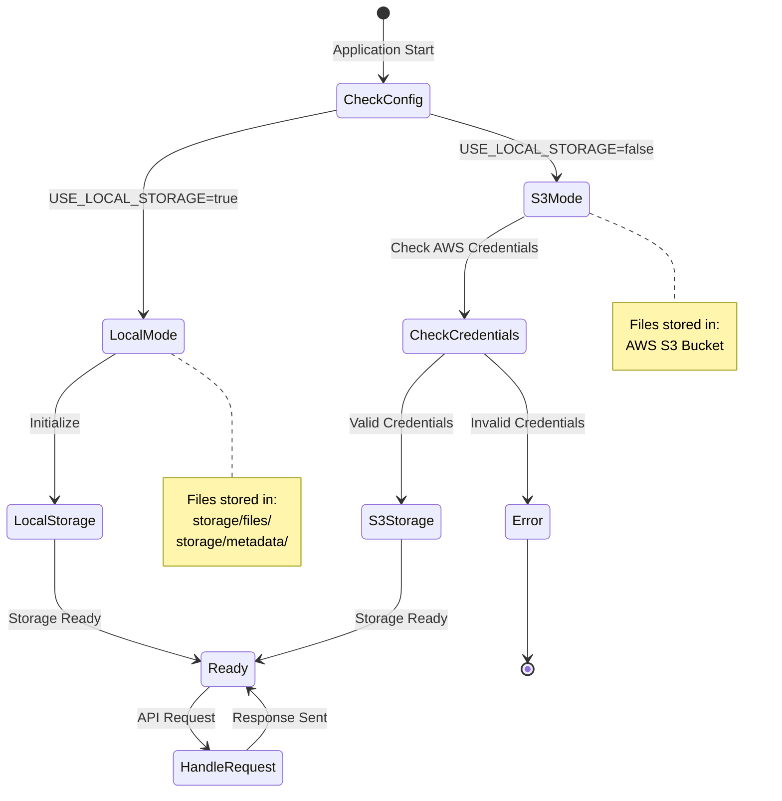

## Безопасность и обработка ошибок

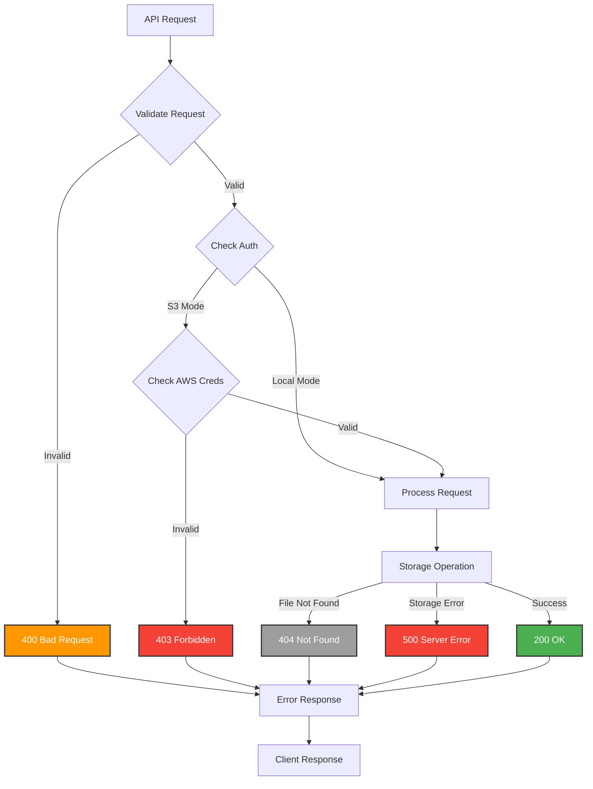

## Компоненты фронтенда

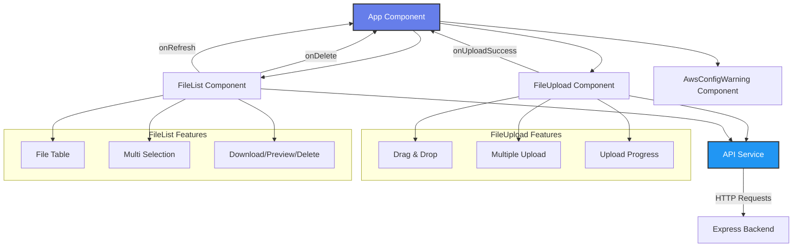

## Схема хранения данных

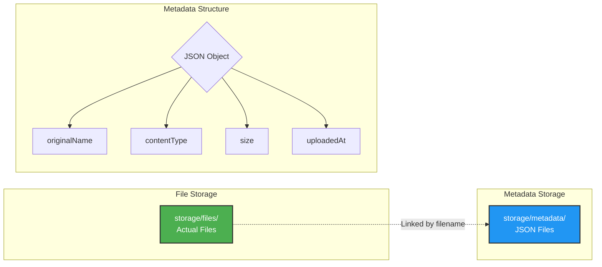

## Полная архитектура системы

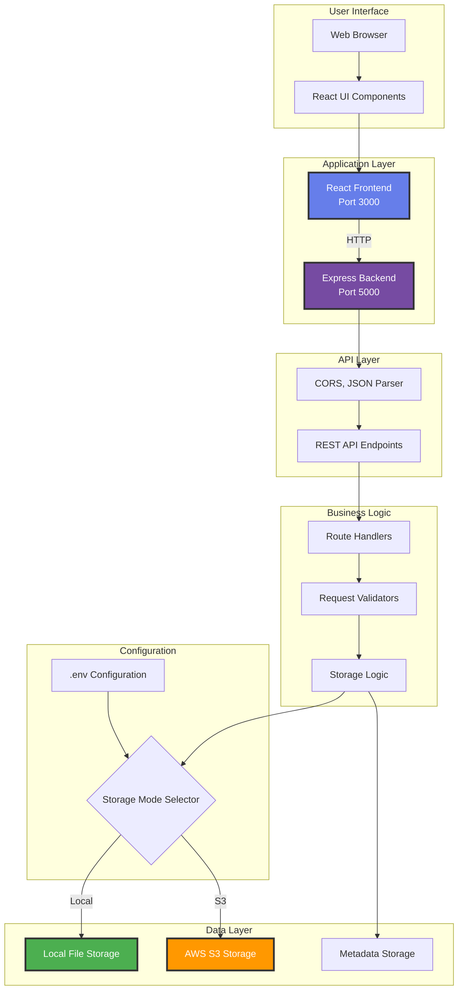

---

## Описание компонентов

### Frontend (React)
- **App.js** - Главный компонент, управляет состоянием
- **FileUpload.js** - Компонент загрузки файлов с drag & drop
- **FileList.js** - Компонент отображения списка файлов
- **api.js** - Клиент для взаимодействия с API

### Backend (Express.js)
- **server/index.js** - Главный файл сервера
- **server/routes/localStorage.js** - Роуты для локального хранилища
- **server/routes/s3.js** - Роуты для AWS S3 (опционально)
- **server/config/localStorage.js** - Конфигурация локального хранилища
- **server/config/s3.js** - Конфигурация AWS S3

### Storage
- **Local Storage** - Файлы в `storage/files/`, метаданные в `storage/metadata/`
- **AWS S3** - Облачное хранилище (опционально)

### Configuration
- **.env** - Конфигурация приложения
- **USE_LOCAL_STORAGE** - Переключатель режима работы
