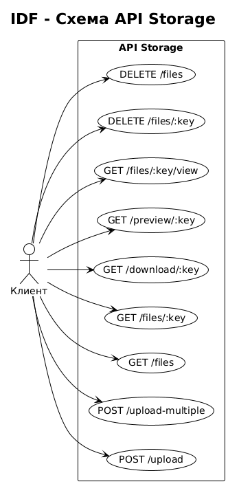

# Документация IDF (Interface Definition)

## Описание интерфейсов API приложения S3 Storage

**Версия:** 1.0  
**Дата:** 2026  
**Формат:** REST API

### Схема API



---

## 1. Общая информация

### 1.1 Назначение

IDF описывает программные интерфейсы (API) приложения хранения файлов. Документ определяет контракты взаимодействия между клиентским приложением (фронтенд) и серверной частью (бэкенд).

### 1.2 Базовый URL

| Среда        | URL                             |
|--------------|----------------------------------|
| Разработка   | `http://localhost:5000/api/storage` |
| Локальное    | `http://localhost:5000/api/storage` |
| AWS S3 режим | `http://localhost:5000/api/s3`   |

### 1.3 Формат данных

- **Request:** `multipart/form-data` (загрузка файлов), `application/json` (прочие запросы)
- **Response:** `application/json` (кроме скачивания файлов — `application/octet-stream` или конкретный MIME-тип)
- **Кодировка:** UTF-8

### 1.4 Аутентификация

В текущей версии API не требует аутентификации. Все эндпоинты публичные.

---

## 2. Эндпоинты API

### 2.1 Загрузка одного файла

**Метод:** `POST`  
**Путь:** `/upload`  
**Content-Type:** `multipart/form-data`

#### Параметры запроса

| Параметр | Тип   | Обязательный | Описание                    |
|----------|-------|--------------|-----------------------------|
| file     | File  | Да           | Файл для загрузки           |

#### Ограничения

- Максимальный размер файла: **100 МБ**
- Поддерживаются любые типы файлов

#### Успешный ответ (200 OK)

```json
{
  "success": true,
  "message": "File uploaded successfully",
  "file": {
    "key": "1739030400000-document.pdf",
    "location": "/api/storage/files/1739030400000-document.pdf",
    "bucket": "local-storage",
    "originalName": "document.pdf",
    "size": 102400,
    "contentType": "application/pdf",
    "uploadedAt": "2026-02-08T20:00:00.000Z"
  }
}
```

#### Структура объекта File

| Поле        | Тип    | Описание                                  |
|-------------|--------|-------------------------------------------|
| key         | string | Уникальный ключ файла в хранилище         |
| location    | string | URL для доступа к файлу                   |
| bucket      | string | Имя хранилища (`local-storage` или имя S3)|
| originalName| string | Оригинальное имя файла                    |
| size        | number | Размер в байтах                           |
| contentType | string | MIME-тип файла                            |
| uploadedAt  | string | Дата и время загрузки (ISO 8601)          |

#### Ошибки

| Код  | Условие              | Тело ответа                                    |
|------|----------------------|------------------------------------------------|
| 400  | Файл не передан      | `{"error": "No file uploaded"}`                |
| 500  | Ошибка сервера       | `{"error": "...", "message": "..."}`           |

---

### 2.2 Загрузка нескольких файлов

**Метод:** `POST`  
**Путь:** `/upload-multiple`  
**Content-Type:** `multipart/form-data`

#### Параметры запроса

| Параметр | Тип    | Обязательный | Описание                    |
|----------|--------|--------------|-----------------------------|
| files    | File[] | Да           | Массив файлов (макс. 10)    |

#### Успешный ответ (200 OK)

```json
{
  "success": true,
  "message": "3 file(s) uploaded successfully",
  "files": [
    {
      "key": "1739030400000-file1.pdf",
      "location": "/api/storage/files/1739030400000-file1.pdf",
      "bucket": "local-storage",
      "originalName": "file1.pdf",
      "size": 10240,
      "contentType": "application/pdf",
      "uploadedAt": "2026-02-08T20:00:00.000Z"
    }
  ]
}
```

#### Ошибки

| Код  | Условие              | Тело ответа                                    |
|------|----------------------|------------------------------------------------|
| 400  | Файлы не переданы    | `{"error": "No files uploaded"}`               |
| 500  | Ошибка сервера       | `{"error": "...", "message": "..."}`           |

---

### 2.3 Получение списка файлов

**Метод:** `GET`  
**Путь:** `/files`

#### Параметры запроса

Отсутствуют.

#### Успешный ответ (200 OK)

```json
{
  "success": true,
  "count": 5,
  "files": [
    {
      "key": "1739030400000-document.pdf",
      "size": 102400,
      "lastModified": "2026-02-08T20:00:00.000Z",
      "etag": "\"1739030400000\"",
      "contentType": "application/pdf",
      "originalName": "document.pdf"
    }
  ]
}
```

#### Структура объекта в массиве files

| Поле        | Тип    | Описание                          |
|-------------|--------|-----------------------------------|
| key         | string | Ключ файла                        |
| size        | number | Размер в байтах                   |
| lastModified| string | Дата изменения (ISO 8601)         |
| etag        | string | ETag для кэширования              |
| contentType | string | MIME-тип                          |
| originalName| string | Оригинальное имя файла            |

#### Ошибки

| Код  | Описание           | Тело ответа                                   |
|------|--------------------|-----------------------------------------------|
| 500  | Ошибка сервера     | `{"error": "Failed to list files", "message": "..."}` |

---

### 2.4 Получение информации о файле

**Метод:** `GET`  
**Путь:** `/files/:key`

#### Параметры пути

| Параметр | Тип   | Описание                    |
|----------|-------|-----------------------------|
| key      | string| Ключ файла (URL-encoded)    |

#### Успешный ответ (200 OK)

```json
{
  "success": true,
  "file": {
    "key": "1739030400000-document.pdf",
    "size": 102400,
    "lastModified": "2026-02-08T20:00:00.000Z",
    "etag": "\"1739030400000\"",
    "contentType": "application/pdf",
    "metadata": {
      "originalName": "document.pdf",
      "uploadedAt": "2026-02-08T20:00:00.000Z"
    }
  }
}
```

#### Ошибки

| Код  | Условие        | Тело ответа                    |
|------|----------------|--------------------------------|
| 404  | Файл не найден | `{"error": "File not found"}`  |
| 500  | Ошибка сервера | `{"error": "...", "message": "..."}` |

---

### 2.5 Скачивание файла

**Метод:** `GET`  
**Путь:** `/download/:key`

#### Параметры пути

| Параметр | Тип   | Описание                    |
|----------|-------|-----------------------------|
| key      | string| Ключ файла (URL-encoded)    |

#### Успешный ответ (200 OK)

- **Content-Type:** MIME-тип файла или `application/octet-stream`
- **Content-Disposition:** `attachment; filename="оригинальное_имя"`
- **Content-Length:** размер файла в байтах
- **Тело:** бинарные данные файла (stream)

#### Ошибки

| Код  | Условие        | Тело ответа (JSON)             |
|------|----------------|--------------------------------|
| 404  | Файл не найден | `{"error": "File not found"}`  |
| 500  | Ошибка сервера | `{"error": "...", "message": "..."}` |

---

### 2.6 Получение URL для предпросмотра

**Метод:** `GET`  
**Путь:** `/preview/:key`

#### Параметры пути

| Параметр | Тип   | Описание                    |
|----------|-------|-----------------------------|
| key      | string| Ключ файла (URL-encoded)    |

#### Успешный ответ (200 OK)

```json
{
  "success": true,
  "url": "http://localhost:5000/api/storage/files/1739030400000-document.pdf",
  "expiresIn": null
}
```

| Поле     | Тип    | Описание                                              |
|----------|--------|-------------------------------------------------------|
| url      | string | Базовый URL файла. Для просмотра контента добавить суффикс `/view` |
| expiresIn| number\|null | Срок действия URL в секундах (null для локального) |

**Примечание:** Для отображения файла в браузере используйте `{url}/view`.

#### Ошибки

| Код  | Условие        | Тело ответа                    |
|------|----------------|--------------------------------|
| 404  | Файл не найден | `{"error": "File not found"}`  |
| 500  | Ошибка сервера | `{"error": "...", "message": "..."}` |

---

### 2.7 Просмотр файла (inline)

**Метод:** `GET`  
**Путь:** `/files/:key/view`

Используется для отображения файла в браузере (изображения, PDF и т.д.).

#### Параметры пути

| Параметр | Тип   | Описание                    |
|----------|-------|-----------------------------|
| key      | string| Ключ файла (URL-encoded)    |

#### Успешный ответ (200 OK)

- **Content-Type:** MIME-тип файла
- **Тело:** бинарные данные файла

---

### 2.8 Удаление одного файла

**Метод:** `DELETE`  
**Путь:** `/files/:key`

#### Параметры пути

| Параметр | Тип   | Описание                    |
|----------|-------|-----------------------------|
| key      | string| Ключ файла (URL-encoded)    |

#### Успешный ответ (200 OK)

```json
{
  "success": true,
  "message": "File deleted successfully",
  "key": "1739030400000-document.pdf"
}
```

#### Ошибки

| Код  | Описание           | Тело ответа                                   |
|------|--------------------|-----------------------------------------------|
| 500  | Ошибка сервера     | `{"error": "Failed to delete file", "message": "..."}` |

---

### 2.9 Удаление нескольких файлов

**Метод:** `DELETE`  
**Путь:** `/files`  
**Content-Type:** `application/json`

#### Тело запроса

```json
{
  "keys": [
    "1739030400000-file1.pdf",
    "1739030400001-file2.txt"
  ]
}
```

| Поле | Тип     | Обязательный | Описание              |
|------|---------|--------------|------------------------|
| keys | string[]| Да           | Массив ключей файлов  |

#### Успешный ответ (200 OK)

```json
{
  "success": true,
  "message": "2 file(s) deleted successfully",
  "deleted": [
    {"key": "1739030400000-file1.pdf"},
    {"key": "1739030400001-file2.txt"}
  ],
  "errors": []
}
```

При частичном успехе в `errors` будут объекты вида: `{"key": "...", "error": "..."}`

#### Ошибки

| Код  | Условие           | Тело ответа                                    |
|------|-------------------|------------------------------------------------|
| 400  | keys не передан   | `{"error": "No keys provided"}`                |
| 500  | Ошибка сервера    | `{"error": "Failed to delete files", "message": "..."}` |

---

### 2.10 Проверка работоспособности

**Метод:** `GET`  
**Путь:** `/api/health` (относительно корня сервера, не /api/storage)

#### Успешный ответ (200 OK)

```json
{
  "status": "ok",
  "message": "S3 Storage API is running"
}
```

---

## 3. Общие структуры данных

### 3.1 Стандартный успешный ответ

```json
{
  "success": true,
  "message": "Описание результата",
  "data": {}
}
```

### 3.2 Стандартный ответ об ошибке

```json
{
  "error": "Краткое описание ошибки",
  "message": "Детальное сообщение (опционально)",
  "code": "КОД_ОШИБКИ"
}
```

### 3.3 HTTP-коды ответов

| Код | Описание                    |
|-----|-----------------------------|
| 200 | Успешное выполнение         |
| 400 | Некорректный запрос         |
| 404 | Ресурс не найден            |
| 500 | Внутренняя ошибка сервера   |

---

## 4. Интеграция с фронтендом

### 4.1 Модуль API (client/src/services/api.js)

| Функция        | Метод | Endpoint                    | Описание            |
|----------------|-------|-----------------------------|---------------------|
| uploadFile     | POST  | /upload                     | Загрузка 1 файла    |
| uploadFiles    | POST  | /upload-multiple            | Загрузка N файлов   |
| getFiles       | GET   | /files                      | Список файлов       |
| getFileDetails | GET   | /files/:key                 | Информация о файле  |
| downloadFile   | GET   | /download/:key              | Скачать файл        |
| getPreviewUrl  | GET   | /preview/:key               | URL предпросмотра   |
| deleteFile     | DELETE| /files/:key                 | Удалить 1 файл      |
| deleteFiles    | DELETE| /files                      | Удалить N файлов    |

### 4.2 Таймаут запросов

По умолчанию: **30 секунд**

### 4.3 CORS

Разрешён origin: `http://localhost:3000` (настраивается через `CLIENT_URL` в .env)

---

## 5. Режимы работы

### 5.1 Локальное хранилище (USE_LOCAL_STORAGE=true)

- **Base path:** `/api/storage`
- **Файлы:** `storage/files/`
- **Метаданные:** `storage/metadata/*.json`

### 5.2 AWS S3 (USE_LOCAL_STORAGE=false)

- **Base path:** `/api/s3`
- **Файлы:** AWS S3 Bucket
- **Требуется:** настройка AWS credentials в .env

Интерфейс API идентичен в обоих режимах.

---

## 6. Версионирование

Текущая версия API: **1.0**

При изменении интерфейсов документ будет обновляться с указанием версии и даты.
